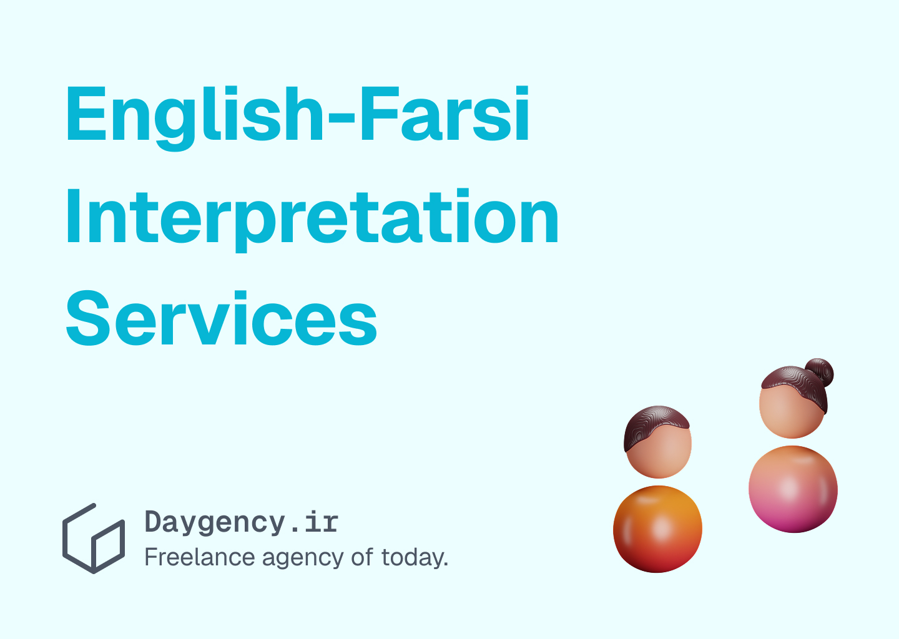

---
aliases:
  - En-Fa Interpretation Services Support Research in Iran
description: Let's learn how interpretation services support academic interviews and field research in Iran.
date: 2025-03-26
tags:
  - blog
image: ../media/en-fa-interpretation-support-reserach-iran.jpg
authors:
  - zachshirow
  - hemra
---

In this article we will dive deeper into the role of interpreters in facilitating interviews, focus groups, and data collection in general and specifically when conducting field research in Iran. 

As foreign universities increasingly conduct academic research in Iran, effective communication is essential for collecting accurate, meaningful, and culturally relevant data. Whether conducting interviews with local experts, focus groups with participants, or field observations, Farsi-English interpretation services play a vital role in ensuring that researchers can accurately engage with Iranian participants and capture the full depth of their insights.

In this article, we will explore how professional interpretation services support academic interviews and field research in Iran, helping universities gather credible, nuanced, and culturally informed data.

---

## 1. Why Interpretation Services Are Essential for Iran-Based Academic Research

**A. Bridging the Language Gap**

Many Iranian participants, experts, and field contacts primarily speak Farsi, making it challenging for foreign researchers to conduct interviews or facilitate discussions without support. Interpreters act as a linguistic bridge, ensuring that both parties can communicate accurately and effectively.

Professional interpretation services help researchers:

- Accurately understand participant responses without missing nuances.
- Ask clarifying questions in real time to gain deeper insights.
- Ensure that participants’ voices are faithfully represented in the research.

**B. Preserving Cultural and Contextual Meaning**

Language in Iran is deeply connected to cultural norms, idioms, and social expressions. When conducting field research, interpreting the cultural context is just as important as translating the words.

- Farsi idioms, metaphors, and cultural references often carry meanings that may be lost in direct translation.
- A skilled interpreter conveys both the literal message and the underlying cultural context, ensuring the researcher receives an accurate and authentic representation.

**C. Enhancing Data Collection Quality**

Field research often involves dynamic and interactive settings, such as:

- Focus groups with multiple participants expressing varied opinions.
- On-the-ground interviews with business owners, policymakers, or locals.
- Participant observations in real-world environments.

In such settings, interpreters ensure that:

- Complex discussions are accurately translated without losing context.
- Researchers can clarify and probe deeper through follow-up questions.
- Language barriers do not hinder data accuracy or research quality.

---

## 2. Types of Academic Research That Benefit From Interpretation in Iran

**A. Qualitative Interviews**

Foreign universities frequently conduct qualitative interviews with Iranian participants, including:

- Experts and policymakers providing insights on local regulations and industry practices.
- Business owners or consumers sharing market trends and purchasing behaviors.
- Scholars and researchers offering historical, cultural, or technical knowledge.

Interpreters facilitate these interviews by:

- Accurately conveying participant responses in real time.
- Preserving intonation, emphasis, and emotional cues.
- Ensuring that technical terms or academic jargon are translated correctly.

**B. Focus Groups and Community Discussions**

In social studies and market research, focus groups are valuable for collecting diverse perspectives. However, managing a multilingual focus group without interpretation can lead to miscommunication and loss of valuable insights.

Interpreters help by:

- Simultaneously interpreting multiple participants' responses, allowing the researcher to stay engaged.
- Ensuring consistent terminology throughout the discussion.
- Relaying emotional tones, humor, or cultural references to preserve authenticity.

**C. Ethnographic Field Research**

For anthropological, sociological, or cultural studies, universities often conduct on-the-ground field research in Iran, observing and interacting with local communities.

- In such contexts, interpreters assist with spontaneous conversations and ad-hoc interviews.
- They help researchers ask clarifying questions in the moment, ensuring they fully understand the context.
- Interpreters can also navigate local customs and etiquette, helping researchers avoid misunderstandings.

**D. Surveys and Questionnaires**

In survey-based research, interpreters can assist with:

- Administering surveys to Farsi-speaking participants.
- Clarifying questions or instructions to ensure accurate responses.
- Helping participants understand technical or academic terminology.

---

## 3. Key Qualities of Effective Academic Interpreters

**A. Language Proficiency and Subject Matter Expertise**

Interpreting academic interviews requires fluency in both Farsi and English, along with familiarity with academic terminology and research language.

- Interpreters with sector-specific knowledge (e.g., legal, medical, or business) ensure precise translations of technical terms.
- They must be able to adapt to complex academic discussions and maintain accuracy under pressure.

**B. Cultural Competence**

Interpreters must possess cultural awareness to accurately convey both language and context.

- They should understand local customs, social norms, and idiomatic expressions.
- Their interpretations should preserve the cultural context behind participants’ responses, adding valuable insights for the researcher.

**C. Accuracy and Neutrality**

Interpreters play a neutral role in academic research, ensuring that they:

- Translate content accurately without omitting or altering meaning.
- Avoid personal bias or interpretation of participant responses.
- Maintain consistency in terminology across the research project.

---

## 4. Best Practices for Using Interpretation Services in Academic Research

**A. Hire Experienced Academic Interpreters**

When conducting research in Iran, it is essential to hire professional interpreters with:

- Experience in academic settings and research terminology.
- Familiarity with Iranian culture and local dialects.
- The ability to provide consecutive or simultaneous interpretation depending on the research needs.

[English-Farsi Interpretation Services](../services/english-farsi-interpretation.md)

**B. Use Consecutive or Simultaneous Interpretation Strategically**

Choose the appropriate interpretation mode based on the research setting:

- Consecutive interpretation: Ideal for one-on-one interviews or small group discussions, allowing for accurate, detailed translation.
- Simultaneous interpretation: Suitable for focus groups or conferences, providing real-time translation without disrupting the flow of conversation.

**C. Ensure Confidentiality and Data Security**

In academic research, maintaining confidentiality is essential, particularly when dealing with sensitive or unpublished data.

- Work with interpreters who sign non-disclosure agreements (NDAs).
- Use secure communication platforms for remote or virtual interpretation.
- Ensure that interpreters are trained in handling confidential data.

[Ensuring Confidentiality in Translations and Transcriptions](confidentiality-translations-transcriptions.md)

**D. Provide Context and Materials in Advance**

To ensure accuracy, share research materials, interview questions, or background information with interpreters beforehand. This allows them to:

- Familiarize themselves with technical terms and concepts.
- Ensure consistent and accurate translation throughout the research.
- Prepare for potential cultural references or sensitive topics.

---

## 5. Benefits of Using Interpretation Services for Academic Research

**A. Accurate and Reliable Data Collection**

Professional interpreters ensure that all participant responses are accurately conveyed, reducing the risk of misinterpretation.

- Researchers gain more precise and reliable insights.
- Nuances, idioms, and cultural references are accurately preserved.

**B. Improved Participant Engagement**

With interpreters facilitating smooth communication, participants are more comfortable expressing their opinions.

- This leads to richer, more authentic responses.
- Researchers can probe deeper into topics without language barriers.

**C. Enhanced Research Efficiency**

Interpreters streamline the research process by eliminating language obstacles, allowing researchers to:

- Focus on content and analysis rather than communication challenges.
- Complete interviews and focus groups faster and more efficiently.

---

## Conclusion

For foreign universities conducting academic interviews, focus groups, and field research in Iran, Farsi-English interpretation is essential for accurate and meaningful data collection. Skilled interpreters not only translate words but also preserve cultural nuances and contextual meaning, ensuring that research findings are authentic, credible, and insightful.

By partnering with experienced academic interpreters, universities can overcome language barriers, enhance participant engagement, and produce high-quality, culturally informed research on Iran.

---

## English-Farsi Interpretation Services at Day Agency

At Day Agency, we offer high-quality Farsi-English interpretation services to help you communicate seamlessly and accurately. We can specifically help you with conducting academic interviews and field research in Iran. 

[Learn more about Farsi-English Interpretation Services](../services/english-farsi-interpretation.md)
