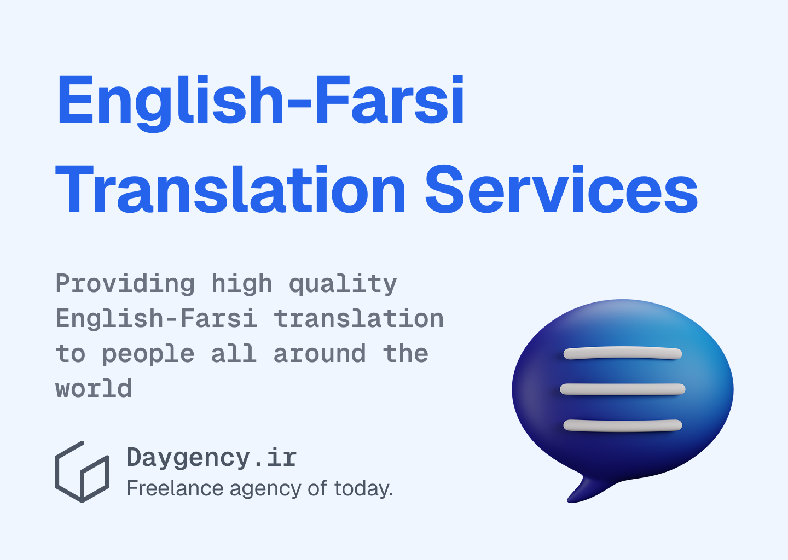

---
aliases:
  - Farsi-English Translations for Universities Researching Iran
description: In this article we will discuss how foreign universities can use Farsi-English Translation for conducting Iran-based research.
date: 2025-03-26
tags:
  - blog
image: ../media/fa-en-translations-universities-worldwide-research-iran.jpg
authors:
  - zachshirow
  - hemra
---

In this article we will discuss how foreign universities can use Farsi-English Translation for conducting Iran-based research. 

As Iran’s economy, society, and culture continue to attract global interest, an increasing number of foreign universities are conducting research on the country. Whether exploring market trends, social behaviors, historical narratives, or linguistic patterns, universities require accurate, reliable Farsi-English translations to gather and interpret data effectively.

From translating academic papers, historical documents, and legal texts to transcribing and translating interviews, surveys, and field notes, professional translation services play a critical role in facilitating high-quality, credible research. In this article, we’ll explore how foreign universities can use Farsi-English translation services to support their Iran-based studies and ensure accurate, culturally informed results.

---

## 1. Why Farsi-English Translation Is Essential for Iran-Based Research

**A. Accessing Primary and Secondary Sources**

Conducting research on Iran often involves working with primary and secondary Farsi-language sources. These include:

- Government reports, regulations, and legal texts
- Historical records and archives
- Academic publications and local research papers
- News articles, journals, and periodicals
- Business and market reports

Without accurate translation, foreign researchers are limited in their access to relevant, up-to-date, and local information. Professional Farsi-English translation enables universities to:

- Access Iranian academic literature that may not be available in English
- Interpret government policies and economic reports for market research
- Study historical and cultural texts for humanities-based research

**B. Collecting and Analyzing Qualitative Data**

Universities conducting field research in Iran often rely on qualitative data collection methods such as interviews, focus groups, and surveys. To extract valuable insights, this data must be:

- Transcribed accurately in Farsi
- Translated precisely into English while preserving context and meaning
- Formatted for analysis, including participant quotes and observations

Accurate translation is essential to ensure the authenticity of participants' voices and to avoid misinterpretation of responses.

**C. Enhancing Collaboration With Local Scholars**

Collaborative research projects with Iranian universities or scholars require seamless communication. Farsi-English translation enables foreign universities to:

- Share academic papers, proposals, and reports with Iranian partners
- Translate conference presentations or research findings
- Collaborate on joint publications in both languages
- Exchange institutional agreements or memoranda of understanding

---

## 2. Types of Research Projects That Benefit From Farsi-English Translation

**A. Market Research**

Foreign universities conducting business and economic studies on Iran need access to:

- Local market reports and industry publications
- Consumer surveys and focus group data
- Company websites, financial statements, and government regulations

Farsi-English translation enables accurate interpretation of market conditions, consumer behaviors, and industry trends, providing universities with reliable insights for their research.

**B. Social and Cultural Studies**

Universities conducting sociology, anthropology, or cultural research on Iran often gather data through:

- Ethnographic interviews with Iranian participants
- Surveys and questionnaires distributed in Farsi
- Historical and cultural texts from local archives

Accurate translation ensures that nuanced cultural expressions, idioms, and perspectives are preserved, allowing researchers to interpret the data authentically.

**C. Political and Legal Research**

For universities studying Iran’s political landscape, governance, and legal system, Farsi-English translation is essential for:

- Translating legal documents, such as laws, regulations, and court rulings
- Analyzing political speeches and government reports
- Interpreting news articles and commentary from local media

Precise translation allows foreign universities to evaluate policy changes, regulatory frameworks, and political trends with clarity and accuracy.

---

## 3. Best Practices for Using Farsi-English Translation in Academic Research

**A. Use Professional Academic Translators**

When conducting research, it is critical to work with experienced academic translators who understand both linguistic nuances and research terminology.

- Choose translators with subject-matter expertise (e.g., legal, economic, or social sciences).
- Ensure they are familiar with academic citation standards and formatting conventions.
- Verify that the translators can maintain the scholarly tone and style of the original content.

**B. Ensure Accuracy in Qualitative Data Translation**

For research involving interviews, focus groups, or surveys, it is essential to prioritize:

- Verbatim transcription in Farsi to capture every word accurately.
- Careful translation that preserves tone, emotion, and context.
- Use of consistent terminology throughout the translated content.

**C. Prioritize Confidentiality and Data Security**

Universities working with sensitive or unpublished research data must ensure confidentiality.

- Use secure file-sharing platforms for exchanging documents.
- Require translators to sign non-disclosure agreements (NDAs).
- Work with translation services that comply with data protection regulations.

**D. Localize and Contextualize Translations**

When conducting market or cultural research, translation alone may not be sufficient. Universities benefit from localization and cultural adaptation to ensure the content resonates with the Iranian context.

- Translate Farsi idioms, metaphors, and references accurately into contextually appropriate English.
- Ensure that cultural nuances are reflected correctly in the final translation.
- Adapt survey questions or interview prompts to match local norms and customs.

---

## 4. Benefits of Farsi-English Translation for Foreign Universities

**A. Improved Data Accuracy and Credibility**

Accurate translation ensures that research findings remain reliable and true to the original data. This prevents:

- Misinterpretation of complex concepts or participant responses
- Loss of meaning due to inaccurate or literal translations
- Distortion of academic or cultural contexts

**B. Enhanced Collaboration With Local Institutions**

High-quality Farsi-English translation strengthens partnerships with Iranian universities by facilitating clear communication. This leads to:

- Smoother collaborative research projects
- More effective joint publications
- Better integration of local expertise into foreign research

**C. Expanded Access to Local Knowledge**

Accurate translation provides foreign universities with direct access to Iranian scholarship, media, and market reports. This enables researchers to:

- Cite local academic sources accurately
- Use first-hand data rather than relying on third-party interpretations
- Gain a deeper, more authentic understanding of Iran’s social and economic landscape

---

## Conclusion

For foreign universities conducting Iran-based research, Farsi-English translation is not just a practical necessity—it is a critical tool for ensuring accuracy, credibility, and cultural authenticity. Whether translating legal documents, academic publications, or qualitative data, working with professional translators ensures that research findings remain clear, accurate, and reliable.

By partnering with a trusted freelance translation agency, universities can effectively navigate language barriers, access primary sources, and collaborate with local experts, enabling them to produce high-quality, impactful academic research on Iran.

## English-Farsi Translations at Day Agency 

> at Day Agency, we are assisting Universities worldwide that are conducting market research, social studies, and cultural analysis in Iran. See our rates in the following page: 

[English-Farsi Translation Services](../services/english-farsi-translation.md)