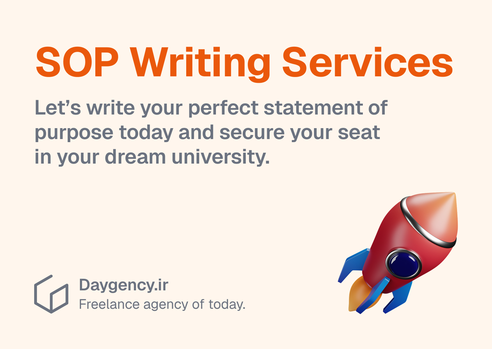

---
aliases:
  - How to Write a Compelling SOP
description: Here in this article we'll explain how to write a statement of purpose (SOP) for university applications
date: 2025-03-26
tags:
  - blog
  - writing
image: ../media/how-sop-writing.jpg
authors:
  - zachshirow
  - hemra
---
Here in this article we'll explain how to write a statement of purpose (SOP) for university applications.

A Statement of Purpose (SOP) is a vital part of a university application, especially for graduate programs. It serves as a personal essay that highlights your academic background, career aspirations, motivations for choosing a particular program, and how you intend to contribute to the university community. A well-crafted SOP can significantly strengthen your application and distinguish you from other candidates.

---
### 1. What Is a Statement of Purpose?

An SOP is a formal essay that outlines:

- Your academic and professional background.
- Your reasons for pursuing higher education in a specific field.
- Your short-term and long-term career goals.
- Why you are applying to this particular university and program.
- How you will contribute to the program and benefit from it.

The SOP allows admissions committees to assess not only your qualifications but also your motivation, clarity of purpose, and potential fit for their program.

---

### 2. Structure of a Strong SOP

A compelling SOP typically follows this structure:

**Introduction**

The opening paragraph should immediately capture the reader's attention. You can start with:

- A personal anecdote that reflects your interest in the field.
- A quote or thought-provoking statement.
- A brief overview of your academic background and why you are passionate about the field.

The introduction should smoothly transition into your motivation for applying and briefly mention your long-term career aspirations.

**Academic Background and Achievements**

In this section, highlight your educational journey and accomplishments:

- Mention your undergraduate program, relevant coursework, and any research or projects you have completed.
- Emphasize significant academic achievements, such as publications, awards, or scholarships.
- If applicable, discuss how your academic experiences have shaped your interest in the field.

**Professional Experience (if applicable)**

If you have any work experience, describe how it has contributed to your understanding of the field:

- Mention relevant internships, research assistantships, or part-time jobs.
- Highlight skills you gained and how they align with your academic and career goals.
- Connect your professional experience to your motivation for pursuing further education.

**Why This Program and University?**

Universities want to know why you are specifically applying to their program. To make this section strong:

- Mention specific faculty members whose research interests align with yours.
- Highlight courses, labs, or facilities that attract you.
- Demonstrate that you have thoroughly researched the university and explain why it is the best fit for your goals.

**Career Goals**

Clearly outline your short-term and long-term career objectives:

- Short-term goals: Describe the type of job or role you aim to secure immediately after completing the program (e.g., working as a data analyst, pursuing a PhD, or entering a research position).
- Long-term goals: Explain your broader ambitions, such as contributing to industry advancements, leading your own company, or working in academia.
- Make sure your goals are realistic and aligned with the program you are applying for.

**Conclusion**

End your SOP with a strong and memorable conclusion:

- Reaffirm your passion and commitment to the field.
- Summarize why you are a strong fit for the program.
- Conclude with a forward-looking statement, expressing your excitement about contributing to the university’s academic community.

---

### 3. Tips for Writing a Strong SOP

To make your SOP impactful, follow these tips:

- Be Specific and Concise:  

Avoid vague statements. Instead of saying, _"I am passionate about computer science,"_ mention a specific project or experience that ignited your interest.

- Personalize for Each University:  

Tailor your SOP to each program by referencing unique aspects of the university, such as faculty, courses, or research facilities.

- Maintain a Professional Yet Personal Tone:  

While the SOP is formal, it should still reflect your personality and motivations. Strike a balance between professionalism and authenticity.

- Stay Within the Word Limit:  

Most universities require an SOP between 500-1,000 words. Adhere to the word limit and avoid unnecessary fluff.

- Proofread and Edit Thoroughly:  

Grammar and spelling mistakes can weaken your SOP. Proofread multiple times and ask someone else to review it for clarity and accuracy.

---

### 4. Common Mistakes to Avoid

- Being too generic: Admissions committees value specificity. Avoid using generic statements that could apply to any program.
  
- Repeating your resume: An SOP is not a resume. Instead of listing achievements, describe how they shaped your interests and goals.
  
- Lack of focus: Your SOP should have a clear narrative and purpose. Avoid including irrelevant details.

- Overuse of clichés: Phrases like _“I have always been passionate about…”_ are overused. Instead, describe personal experiences that demonstrate your passion.    

---

### 5. Final Thoughts

A well-written Statement of Purpose is your opportunity to showcase your academic and professional journey, your ambitions, and why you are a perfect fit for the university. It allows you to present yourself beyond grades and test scores, providing the admissions committee with insight into your motivations and potential contributions.

By following the structure and tips outlined in this guide, you can craft a compelling SOP that enhances your chances of securing admission to your desired program.

Need help with a personalized SOP for a specific field or university? Let us know!

[SOP Writing Services](../services/sop-writing-services.md)

